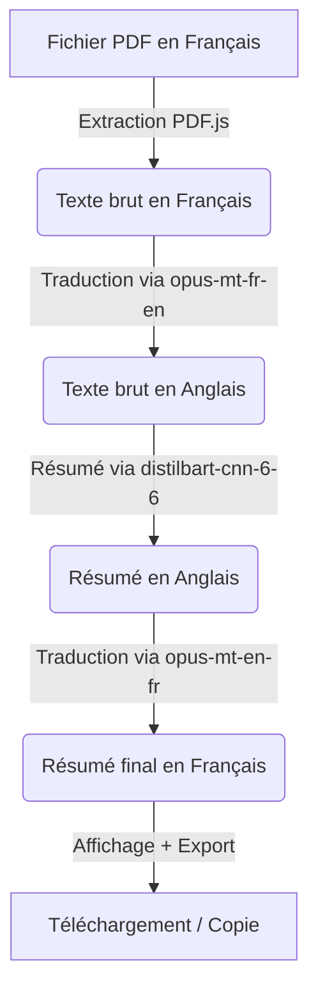

# 📄 Générateur Automatique de Résumés PDF (Client-Side AI)

Ce projet est une application web moderne et responsive qui permet d'extraire le texte de documents PDF pour en générer des résumés structurés de manière entièrement automatique et locale.

## 👥 Étudiante
*   **Bahrini Soufia** (Classe : **2EAN**)

---

## 🚀 Caractéristiques du Projet

*   **Interface Web Premium :** Design moderne en verre dépoli (Glassmorphism), transitions fluides, et mode sombre natif.
*   **100% Client-Side (Zéro coût d'API) :** Pas besoin de clé OpenAI ou Anthropic. Les calculs d'intelligence artificielle s'exécutent localement dans votre navigateur à l'aide de modèles ONNX optimisés et de la bibliothèque **Transformers.js**.
*   **Gestion Multilingue Intelligente :** L'application intègre un pipeline de traduction bidirectionnelle (Français $\leftrightarrow$ Anglais) pour permettre le résumé de documents francophones de façon très précise à l'aide de modèles spécialisés.
*   **Exécution non-bloquante :** L'inférence des modèles s'effectue dans un **Web Worker** séparé afin que l'interface graphique reste parfaitement fluide et interactive.
*   **Fonctionnalités d'Export :** Copie du résumé en un clic, téléchargement au format `.txt` et export en document PDF propre.

---

## 🛠️ Architecture Technique

L'application s'appuie sur les technologies suivantes :
1.  **HTML5 & CSS3 :** Structure sémantique et design moderne.
2.  **PDF.js (Mozilla) :** Extraction du texte brut à partir des fichiers PDF téléversés.
3.  **Transformers.js (Hugging Face) :** Chargement et exécution de modèles de type *Transformer* compilés en WebAssembly (WASM).
4.  **Modèles d'Intelligence Artificielle utilisés (locaux) :**
    *   **Résumé :** `Xenova/distilbart-cnn-6-6` (Modèle BART distillé, optimisé pour la synthèse).
    *   **Traduction Français $\rightarrow$ Anglais :** `Xenova/opus-mt-fr-en` (Helsinki-NLP).
    *   **Traduction Anglais $\rightarrow$ Français :** `Xenova/opus-mt-en-fr` (Helsinki-NLP).

---

## 📦 Installation et Lancement Local

Comme le projet est purement statique et s'exécute côté client, **il n'y a pas d'installation de serveurs complexes ni de bases de données requises**.

### Option 1 : Double-clic (Simple)
1. Téléchargez ou clonez ce dépôt GitHub.
2. Double-cliquez sur le fichier `index.html` pour l'ouvrir dans votre navigateur préféré (Chrome, Edge, Firefox, Safari, etc.).

### Option 2 : Serveur Local (Recommandé pour de meilleures performances)
Pour éviter certaines restrictions liées au protocole `file://` sur les anciens navigateurs, lancez un mini-serveur local :

**Avec VS Code :**
Installez l'extension **Live Server** et cliquez sur "Go Live" sur le fichier `index.html`.

**Avec Python (si installé) :**
```bash
python -m http.server 8000
```
Puis accédez à `http://localhost:8000`.

---

## 📽️ Démonstration Vidéo & Captures d'Écran

*(Ajoutez ici vos captures d'écran et le lien vers votre vidéo de démonstration)*
- **Lien de la vidéo de démo :** `[Lien de votre vidéo ici]`
- **Capture d'écran 1 - Accueil :** `[Image de l'interface d'accueil]`
- **Capture d'écran 2 - Génération :** `[Image pendant le résumé avec la barre de progression]`
- **Capture d'écran 3 - Résultat :** `[Image du résumé généré]`

---

## 📝 Fonctionnement du Pipeline de Traduction-Résumé

Pour surmonter la limitation des modèles de résumé légers qui sont principalement entraînés sur des corpus anglophones, l'application exécute la logique suivante de façon transparente lorsque vous résumez un document en français :


